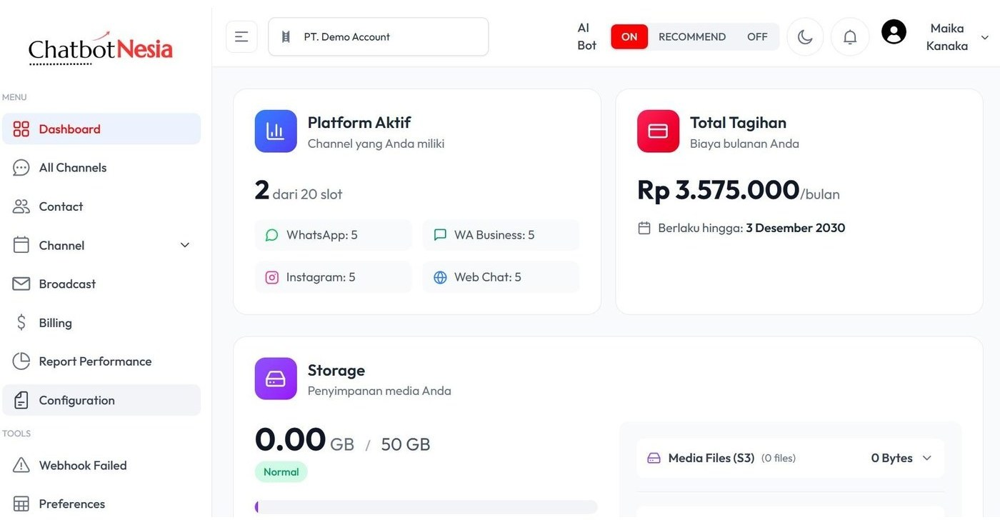
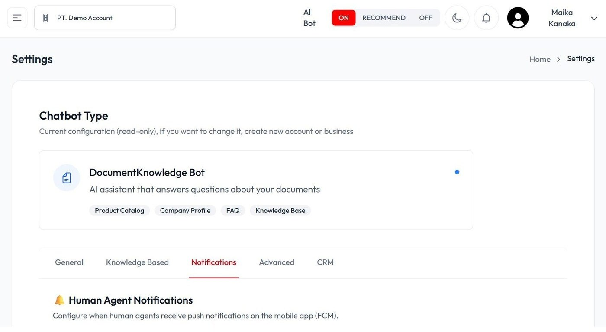
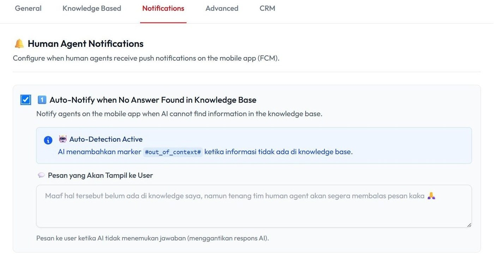
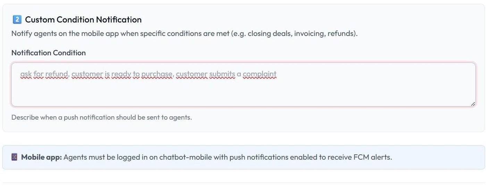
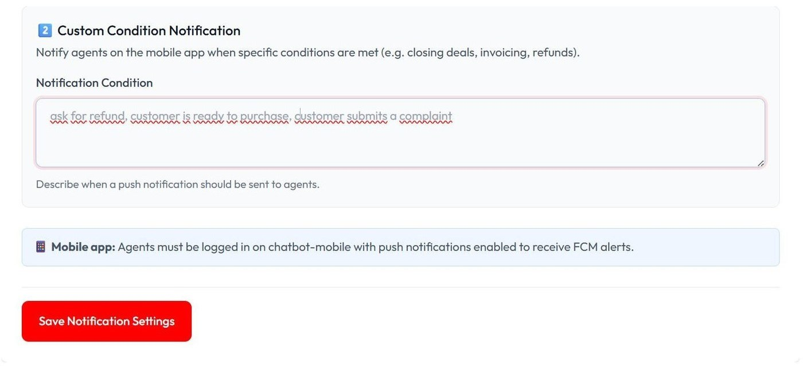
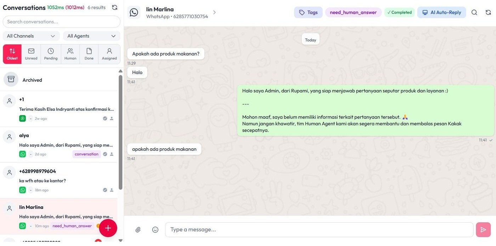
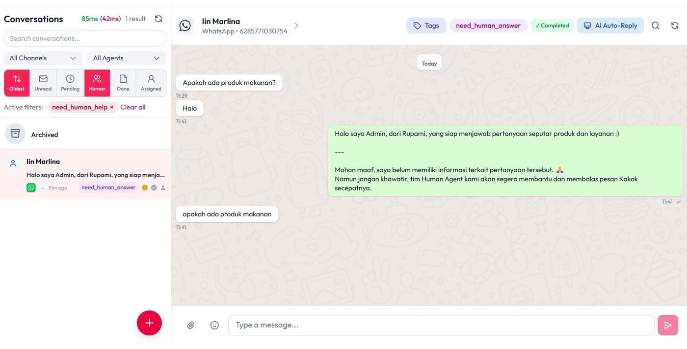

# Atur Chatbot Notifikasi

Tutorial ini menjelaskan cara mengatur notifikasi chatbot agar human agent bisa segera menindaklanjuti percakapan tertentu.

## 1. Masuk ke halaman Configuration

Masuk ke halaman **Configuration**.

## 2. Pilih fitur Notifications

Pilih fitur **Notifications**.

Fitur Notifications memungkinkan Anda mengaktifkan notifikasi otomatis untuk kondisi tertentu pada chatbot. Salah satunya adalah saat AI tidak menemukan jawaban di Knowledge Base, sehingga human agent dapat segera menerima pemberitahuan dan melakukan tindak lanjut tanpa menunggu pelanggan menghubungi kembali.

## 3. Aktifkan Auto-Notify saat jawaban tidak ditemukan

Aktifkan centang **Auto-Notify when No Answer Found in Knowledge Base**.

Fitur ini memastikan pertanyaan yang tidak dapat dijawab AI tetap ditangani dengan baik. Saat informasi tidak ditemukan, sistem akan otomatis memberi tahu human agent dan mengirimkan pesan kepada pengguna, sehingga respons tetap cepat dan akurat.

## 4. Isi pesan untuk user

Masukkan pesan yang akan ditampilkan ke user jika pertanyaan tidak ada di Knowledge Base.

## 5. Atur Custom Condition Notification

Fitur **Custom Condition Notification** membuat sistem bisa mengirim notifikasi otomatis saat ada kondisi atau kata kunci tertentu dalam chat. Begitu AI mendeteksi hal tersebut, notifikasi langsung dikirim ke aplikasi agent, sehingga tim bisa segera menindaklanjuti.

## 6. Tentukan kondisi pemicu dan simpan

Tentukan kondisi yang akan memicu notifikasi push ke agent, lalu klik **Save Notification Settings**.

## 7. Hasil

Setiap pertanyaan di luar Knowledge Base akan memberikan notifikasi kepada human agent.

Setiap pertanyaan yang membutuhkan bantuan human agent akan muncul notifikasi `need_human_agent` dan berada pada fitur **Human**.

## Video tutorial

Tonton juga panduan video berikut untuk mempelajari pengaturan notifikasi chatbot secara visual:

<iframe
  width="100%"
  height="400"
  src="https://www.youtube.com/embed/Ikh9eIkD8vs"
  title="Tutorial Atur Chatbot Notifikasi ChatbotNesia"
  frameBorder="0"
  allow="accelerometer; autoplay; clipboard-write; encrypted-media; gyroscope; picture-in-picture; web-share"
  allowFullScreen
></iframe>

Atau buka langsung di YouTube: [Tutorial Atur Chatbot Notifikasi](https://youtu.be/Ikh9eIkD8vs?si=ntkCrweS0jz6Q4bE)
