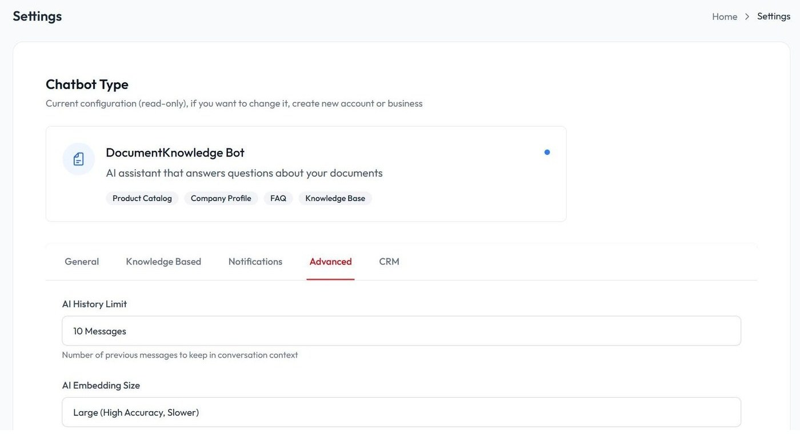
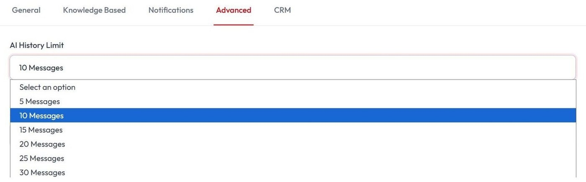
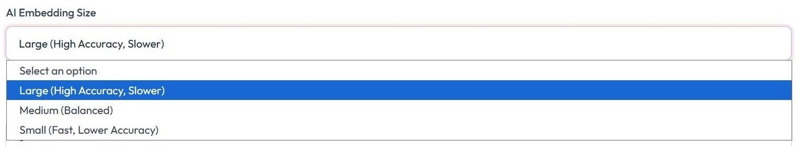
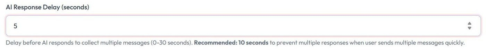
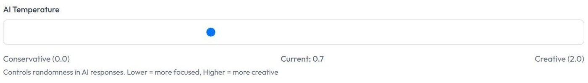
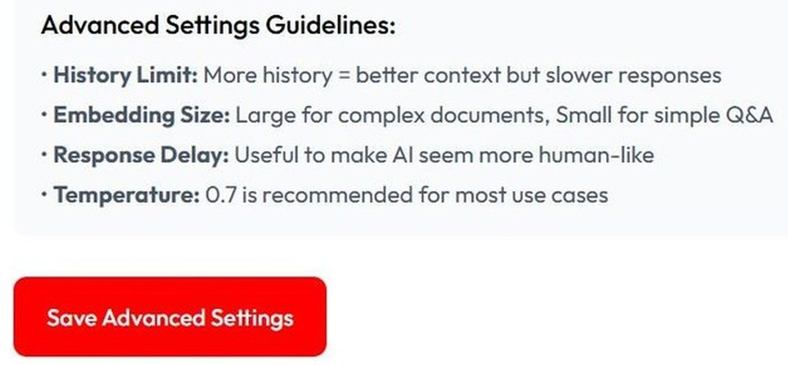

# Membuat Chatbot Lebih Akurat

Tutorial ini menjelaskan pengaturan lanjutan di fitur **Advanced** agar chatbot lebih akurat memahami percakapan.

## 1. Masuk ke halaman Configuration

Masuk ke halaman **Configuration**.

## 2. Pilih fitur Advanced

Pilih fitur **Advanced**.

Fitur Advanced berfungsi untuk mengatur cara kerja chatbot dalam memahami percakapan, mencari informasi dari Knowledge Base, kecepatan respons, dan tingkat kreativitas jawaban.

## 3. Atur AI History Limit

Fitur **AI History Limit** adalah pengaturan yang menentukan seberapa banyak percakapan sebelumnya yang bisa diingat oleh chatbot. Semakin besar nilainya, semakin baik chatbot memahami konteks obrolan yang sedang berlangsung.

Jika nilainya terlalu kecil, chatbot bisa lebih cepat lupa konteks percakapan dan meminta informasi yang sebenarnya sudah disebutkan sebelumnya.

## 4. Atur AI Embedding Size

**AI Embedding Size** menentukan seberapa teliti chatbot dalam mencari dan mencocokkan informasi dari Knowledge Base, seperti dokumen PDF, Excel, atau website yang telah ditambahkan.

Jika Knowledge Base Anda berisi banyak informasi penting atau dokumen detail, disarankan menggunakan opsi **Large** agar hasil pencarian lebih akurat dan risiko jawaban yang kurang tepat dapat diminimalkan.

## 5. Atur AI Response Delay

**AI Response Delay (seconds)** adalah pengaturan waktu tunggu sebelum chatbot memberikan jawaban kepada pengguna. Fitur ini berguna untuk pengguna yang terbiasa mengirim beberapa pesan terpisah dalam waktu singkat.

Dengan jeda beberapa detik, chatbot dapat menggabungkan seluruh pesan menjadi satu konteks percakapan sebelum menjawab.

## 6. Atur AI Temperature

**AI Temperature** digunakan untuk mengatur tingkat kreativitas chatbot saat menyusun jawaban. Semakin rendah nilainya, chatbot lebih fokus pada informasi yang tersedia. Semakin tinggi nilainya, chatbot lebih kreatif dalam merangkai kalimat.

Untuk chatbot Customer Service atau pusat informasi, disarankan menggunakan nilai **0.5-0.7** agar jawaban tetap natural, mudah dipahami, dan tidak keluar dari Knowledge Base.

## 7. Simpan pengaturan

Klik **Save Advanced Settings** untuk menyimpan perubahan.

## Video tutorial

Tonton juga panduan video berikut untuk mempelajari pengaturan advanced secara visual:

<iframe
  width="100%"
  height="400"
  src="https://www.youtube.com/embed/u82YFarEH4A"
  title="Tutorial Membuat Chatbot Lebih Akurat"
  frameBorder="0"
  allow="accelerometer; autoplay; clipboard-write; encrypted-media; gyroscope; picture-in-picture; web-share"
  allowFullScreen
></iframe>

Atau buka langsung di YouTube: [Tutorial Membuat Chatbot Lebih Akurat](https://youtu.be/u82YFarEH4A?si=5u4l2T9FHowOANOe)
