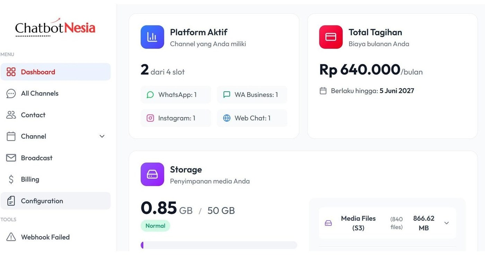
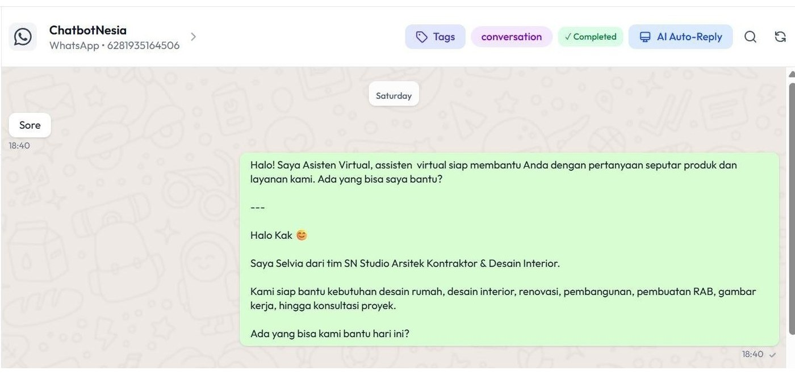
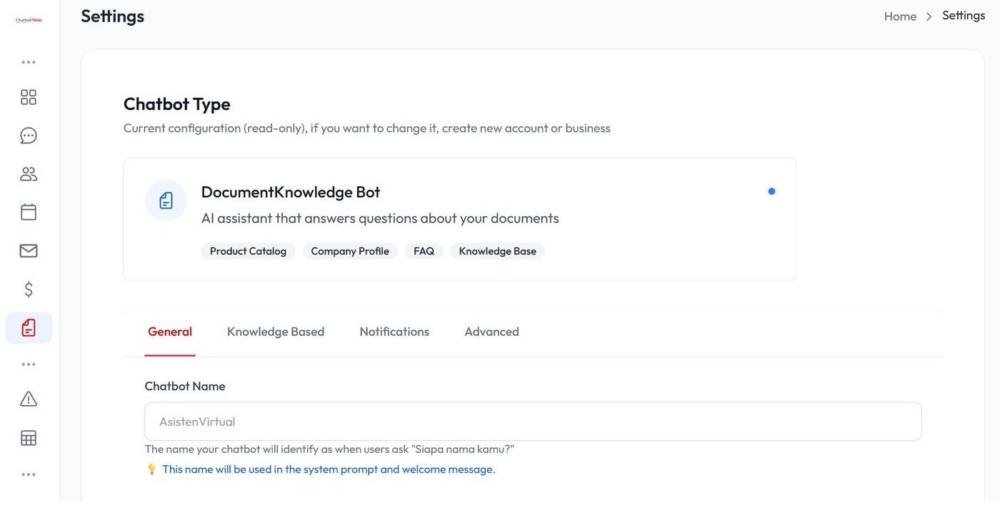
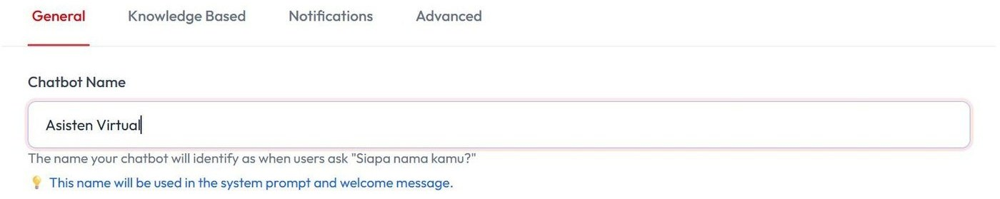
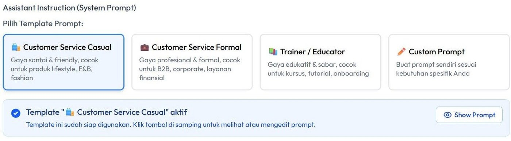
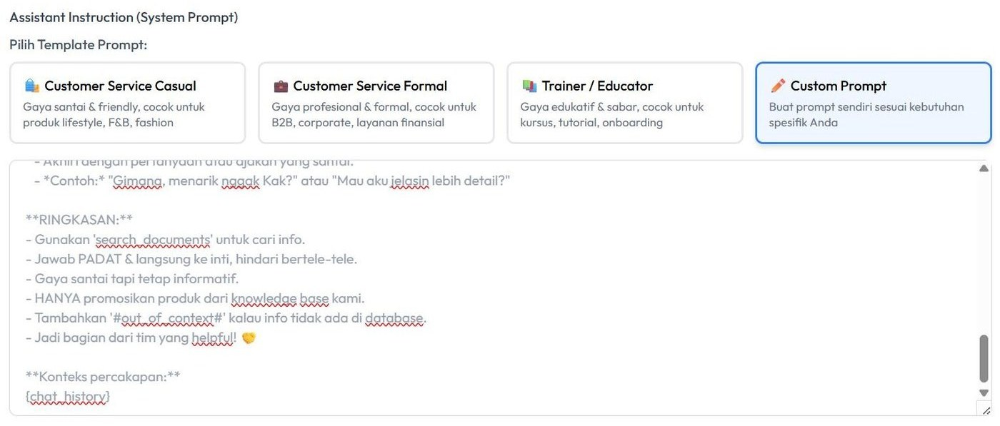
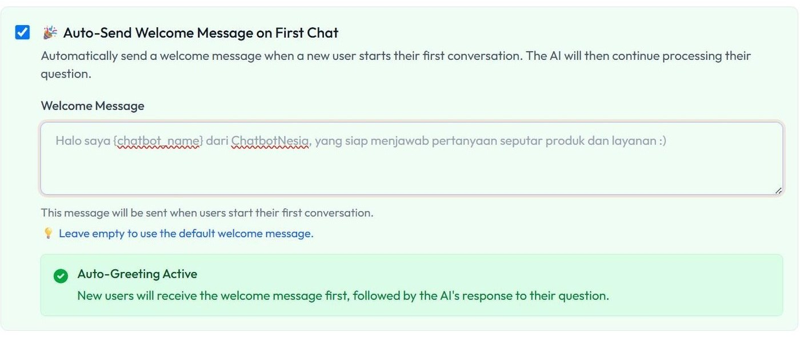
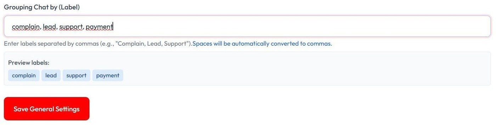
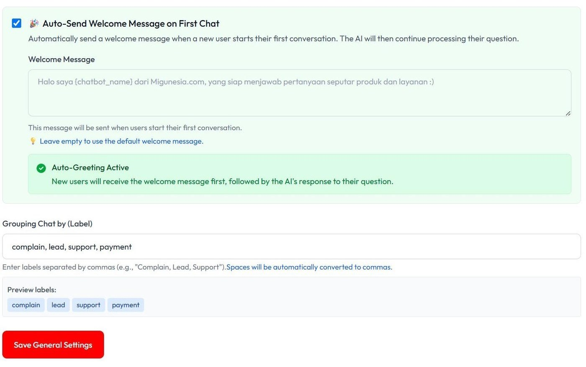

# Setup AI Basic

Tutorial ini menjelaskan cara setup AI Basic di ChatbotNesia sesuai dokumen terbaru, mulai dari pengaturan General hingga hasil pesan sambutan otomatis.

## 1. Masuk ke halaman Configuration

Masuk ke halaman **Configuration** melalui **Menu** di samping.

## 2. Pilih menu General

Pilih menu **General**.

## 3. Masukkan nama chatbot

Masukkan nama Chatbot kamu.

## 4. Pilih gaya bahasa AI

Pilih gaya bahasa AI kamu: **Formal**, **Informal**, **Edukatif**, atau **Custom**.

## 5. Jika memilih Custom, pastikan ada variabel chat history

Jika pilih **Custom**, pastikan ada variabel `{chat_history}`.

## 6. Aktifkan Auto Send Welcome Message

Aktifkan centang **Auto Send Welcome Message**, lalu ketik pesannya.

**Auto Send Welcome Message** adalah fitur yang secara otomatis mengirim pesan sambutan kepada pelanggan saat mereka pertama kali menghubungi Anda.

## 7. Atur Grouping Chat Label

Bagian **Grouping Chat Label** berfungsi untuk mengelompokkan pesan sesuai isi percakapan.

## 8. Simpan pengaturan

Terakhir, klik **Save General Settings**.

## 9. Hasil

Setiap pesan baru yang masuk, AI akan otomatis memberi sapaan atau pesan sambutan.

## Video tutorial

Tonton juga panduan video berikut untuk mempelajari cara setup AI Basic secara visual:

<iframe
  width="100%"
  height="400"
  src="https://www.youtube.com/embed/8sz90XeuQIg"
  title="Tutorial Setup AI Basic di ChatbotNesia"
  frameBorder="0"
  allow="accelerometer; autoplay; clipboard-write; encrypted-media; gyroscope; picture-in-picture; web-share"
  allowFullScreen
></iframe>

Atau buka langsung di YouTube: [Tutorial Setup AI Basic di ChatbotNesia](https://youtu.be/8sz90XeuQIg?si=UJCvB_vlGrwaq606)
