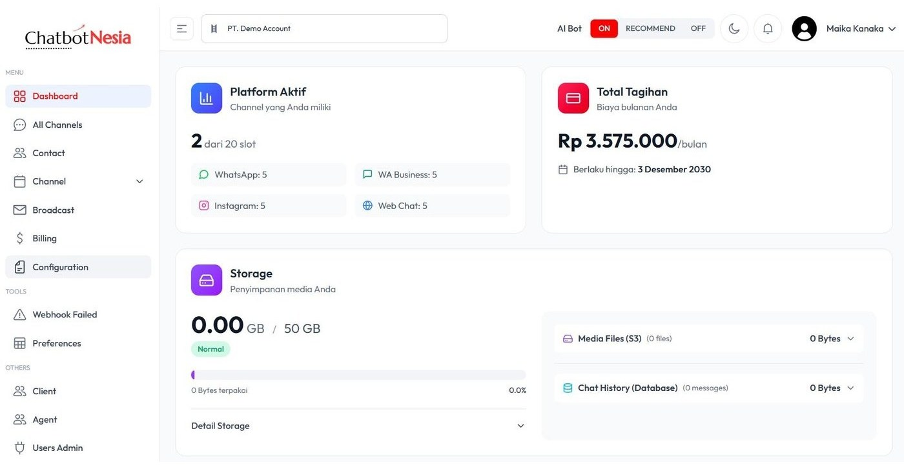
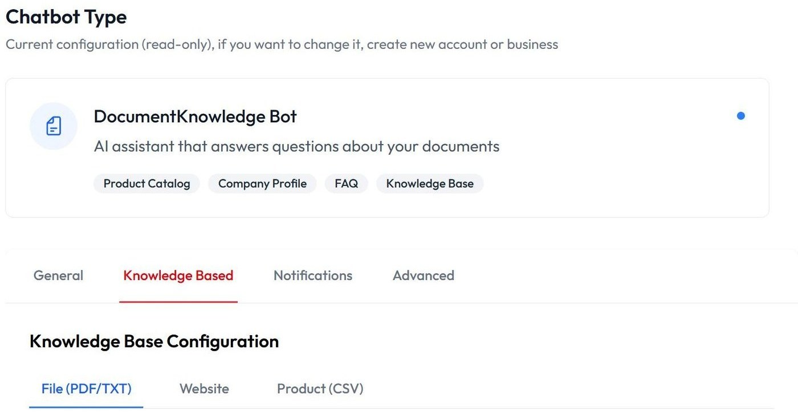
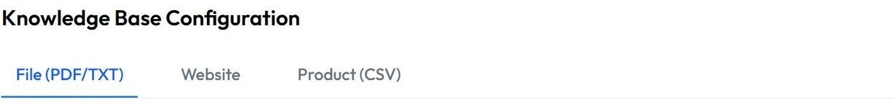
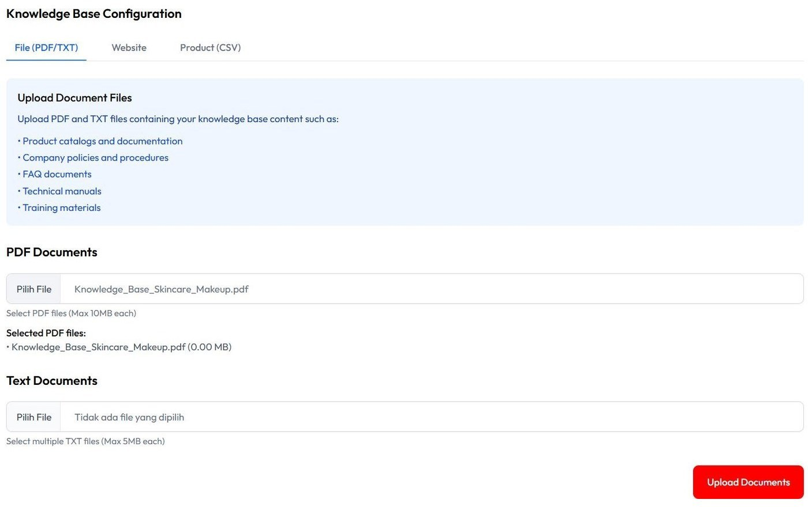
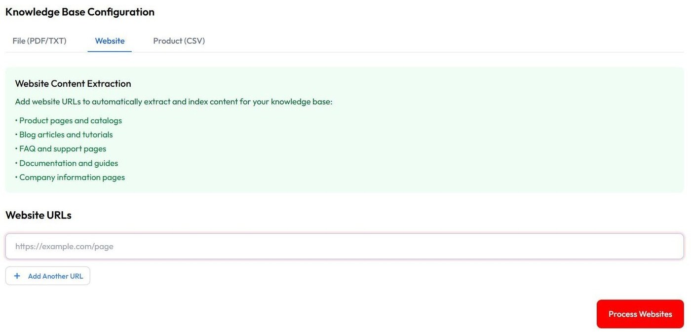
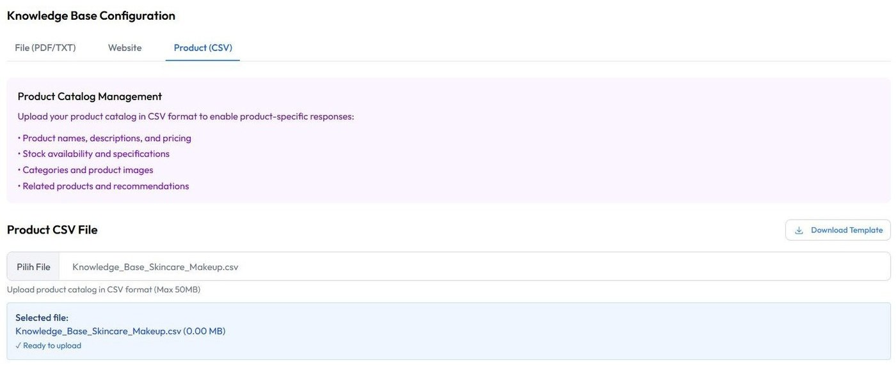
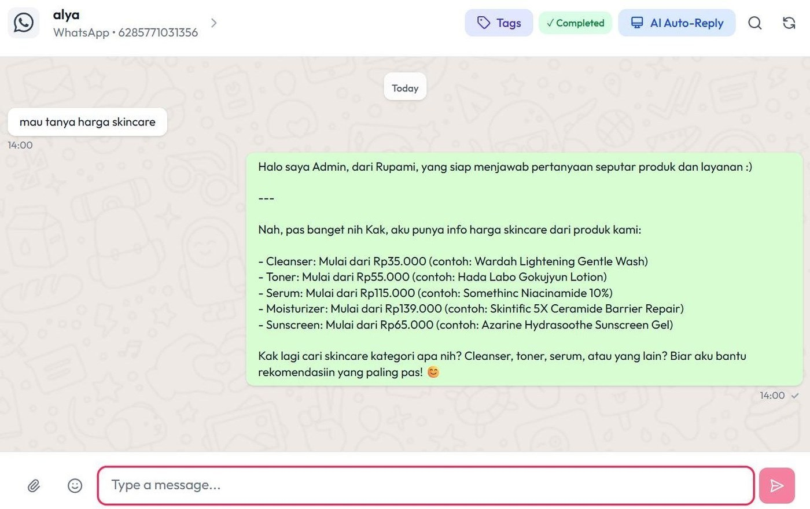

# Upload Knowledge

Tutorial ini menjelaskan cara mengunggah Knowledge Base di ChatbotNesia agar AI dapat mempelajari informasi bisnis, produk, atau layanan Anda.

## 1. Masuk ke halaman Configuration

Masuk ke halaman **Configuration**.

## 2. Pilih fitur Knowledge Based

Pilih fitur **Knowledge Based**.

**Knowledge Base** adalah fitur yang memungkinkan Anda mengajarkan AI tentang bisnis, produk, atau layanan yang Anda miliki.

Cukup unggah dokumen yang berisi informasi penting, lalu AI akan mempelajari isi dokumen tersebut dan menggunakannya untuk menjawab pertanyaan pelanggan secara otomatis.

## 3. Pahami sumber data Knowledge Base

**Knowledge Based Configuration** membantu AI memahami bisnis Anda dengan mendukung berbagai sumber data yang dapat digunakan sebagai referensi, termasuk PDF, link website, dan CSV. Setiap sumber data memiliki keunggulan tersendiri sesuai dengan jenis informasi yang ingin Anda berikan kepada AI.

## 4. Upload PDF / TXT

File PDF/TXT cocok digunakan untuk katalog produk, daftar harga, FAQ, brosur, atau panduan. AI akan membaca isi dokumen dan menggunakannya sebagai referensi saat menjawab pertanyaan pelanggan.

Upload file PDF (max 10MB) / TXT (max 5MB) pada kolom yang tersedia, lalu klik **Upload Documents**.

## 5. Tambahkan Link Website

Anda dapat memasukkan link website agar AI mempelajari informasi yang terdapat pada halaman tersebut. Cocok untuk website perusahaan, toko online, atau halaman dokumentasi. Link website dapat ditambahkan tanpa batasan jumlah, sehingga AI dapat mempelajari informasi dari berbagai halaman website sesuai kebutuhan bisnis Anda.

Masukkan link, lalu klik **Process Websites**.

## 6. Upload CSV

File CSV cocok untuk data yang terstruktur seperti daftar produk, harga, stok, kategori, atau data lainnya. Format ini memudahkan AI dalam mencari dan menampilkan informasi dengan lebih akurat.

Masukkan file CSV (max 50MB), lalu klik **Upload Product Catalog**.

## 7. Hasil

Setiap pertanyaan akan dijawab oleh AI berdasarkan informasi yang tersedia di Knowledge Base. Dengan demikian, jawaban yang diberikan akan mengacu pada data, dokumen, atau sumber informasi yang telah Anda unggah, sehingga lebih akurat, konsisten, dan sesuai dengan kebutuhan bisnis Anda.

## Video tutorial

Tonton juga panduan video berikut untuk mempelajari cara upload Knowledge secara visual:

<iframe
  width="100%"
  height="400"
  src="https://www.youtube.com/embed/dCTQgIC98WI"
  title="Tutorial Upload Knowledge di ChatbotNesia"
  frameBorder="0"
  allow="accelerometer; autoplay; clipboard-write; encrypted-media; gyroscope; picture-in-picture; web-share"
  allowFullScreen
></iframe>

Atau buka langsung di YouTube: [Tutorial Upload Knowledge di ChatbotNesia](https://youtu.be/dCTQgIC98WI?si=lzfmYcYI_fPIQJnx)
