# Cara Membuat Campaign/Broadcast WhatsApp Business

Tutorial ini menjelaskan cara membuat template dan menjalankan broadcast menggunakan WhatsApp Business API melalui ChatbotNesia.

## Masuk ke halaman Broadcast

Masuk ke halaman **Broadcast** melalui menu di samping.

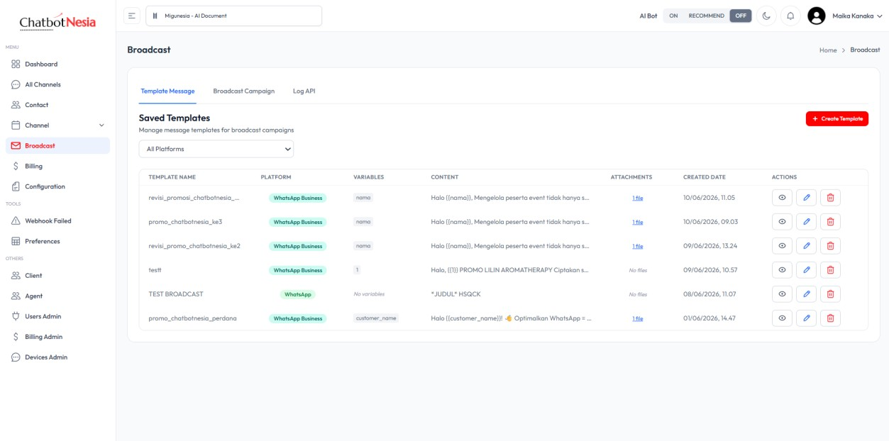

## Buat template message

Pada halaman Broadcast, pilih tab **Template Message**, kemudian klik tombol **Create Template** untuk membuat template baru.

Kemudian pilih bagian **WhatsApp Business**.

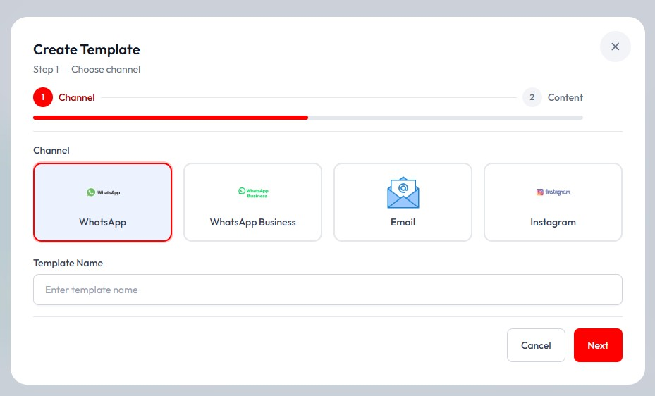

Pilih **Create New Template in Meta** pada tampilan **WhatsApp Business Template**.

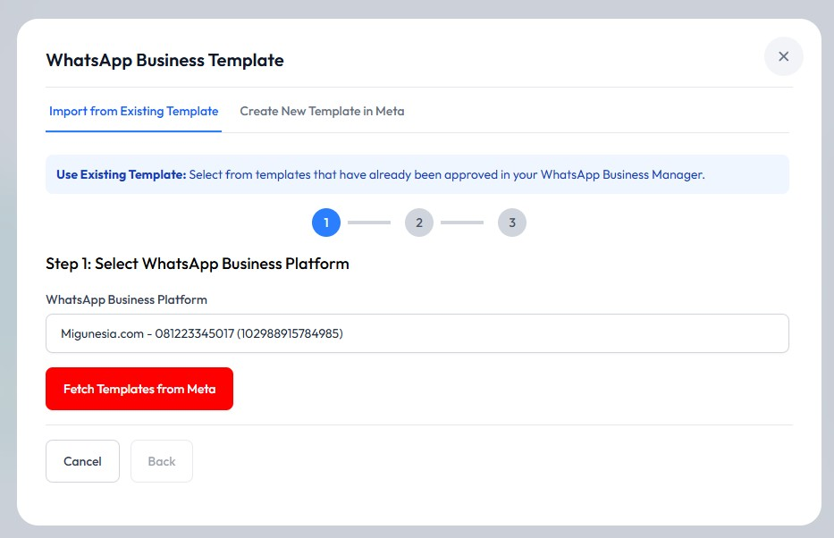

Pada bagian **Template Name** dan **Category**, isi sesuai kebutuhan, kemudian pilih **Continue**.

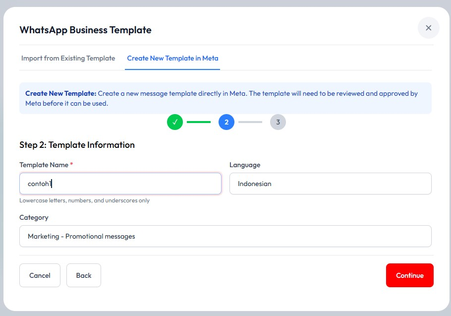

## Isi konten template

Pada Step 3 terdapat beberapa fitur yaitu **Header Type**, **Body Text**, **Footer Text**, **Button**, dan **Template Preview**. Isi template sesuai kebutuhan.

Pada bagian **Header Type**, pilih opsi **Image Header**, kemudian upload foto yang akan dikirim pada bagian **Upload Image**.

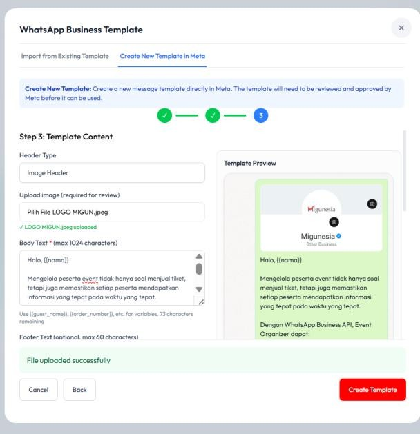

Pada bagian **Body Text**, isi pesan yang akan dibagikan. Sebagai contoh, tambahkan variable `{{nama}}` agar pesan menyesuaikan penerima. Untuk penulisan variable wajib menggunakan tanda `{{ }}`.

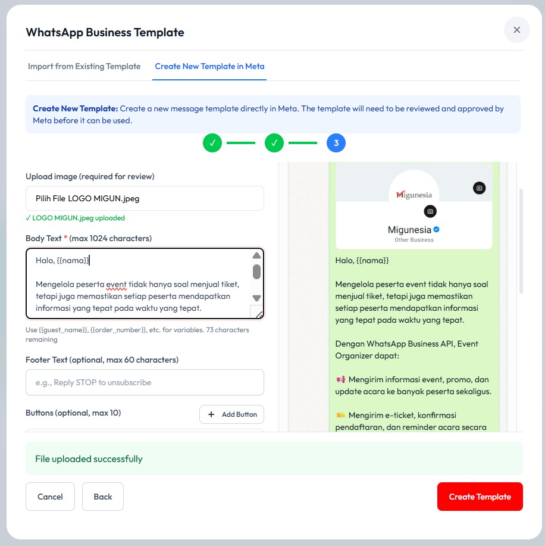

Pada bagian **Button** (opsional), pilih fitur **URL Button**, ubah bagian **Button Text** dengan custom text seperti "Baca Selengkapnya" atau sesuai kebutuhan. Kemudian paste link atau URL yang ingin dicantumkan. Jika template sudah sesuai, pilih **Create Template**.

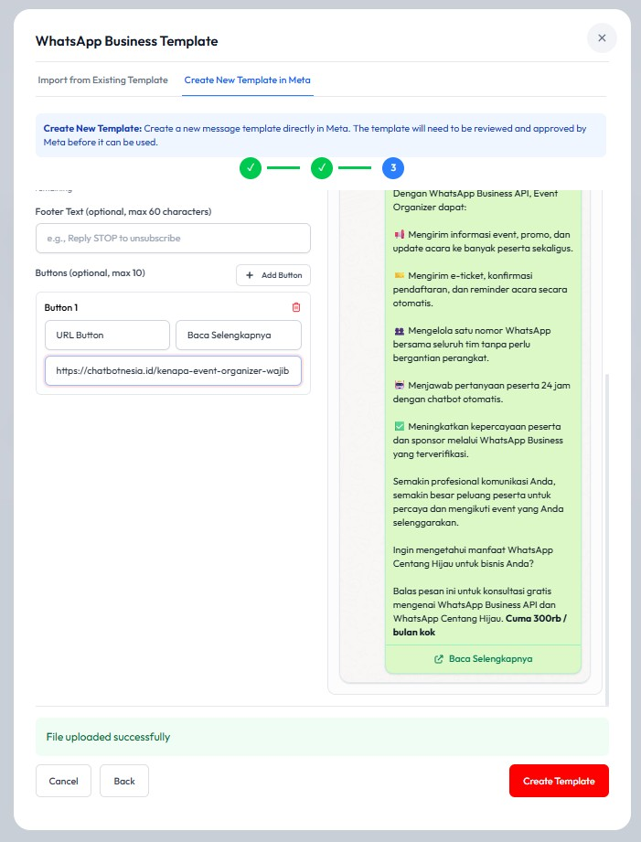

## Import template dari Meta

Setelah template terbuat, pilih **Create Template** lagi untuk kembali ke halaman **Template Message**, kemudian pilih **Import from Existing Template**. Klik tombol **Fetch Templates from Meta** untuk melihat daftar template yang sudah dibuat.

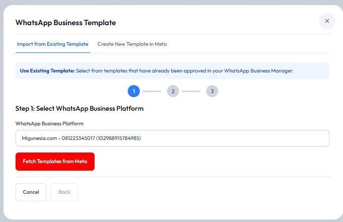

Pada daftar template yang sudah dibuat ada beberapa keterangan status:

- **APPROVED**: Template yang sudah dikonfirmasi oleh Meta dan siap digunakan
- **REJECTED**: Template ditolak oleh Meta karena tidak sesuai dengan ketentuan Meta
- **PENDING**: Template sedang dalam masa peninjauan oleh Meta

Pilih template yang berstatus **APPROVED** karena sudah siap digunakan, kemudian klik **Save Template to Local Database**.

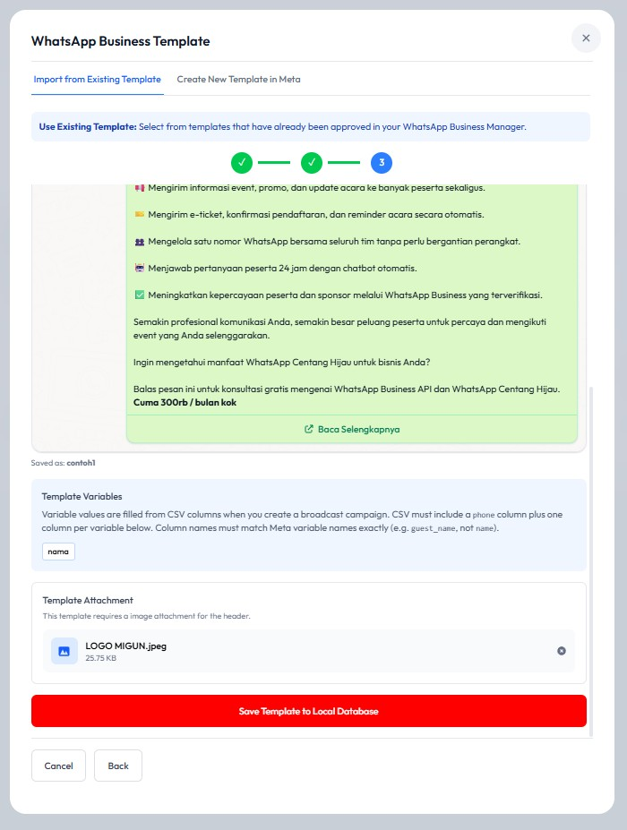

## Buat broadcast campaign

Kembali ke halaman **Broadcast**, pilih menu **Broadcast Campaign** pada tab, lalu klik tombol **Create New Campaign**.

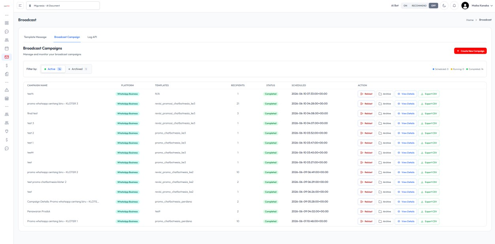

Pada halaman **Create New Campaign**, isi kolom berikut:

- **Campaign Name**
- Pilih **WhatsApp Business** pada bagian Platform
- Pilih **Device/Account**
- Atur **Schedule Date & Time**
- Pilih template yang akan digunakan

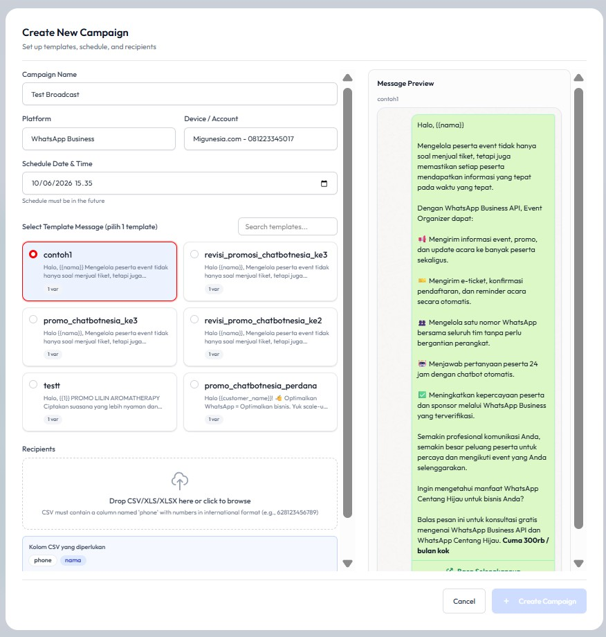

## Siapkan file penerima (CSV)

Download contoh CSV melalui link **Download Example CSV**, kemudian ubah kolom CSV sesuai kebutuhan variable yang ada pada template.

Sebagai contoh, jika template membutuhkan `{{nama}}`, maka di dalam CSV harus ada kolom `phone` (wajib) dan `nama`. Untuk kolom phone, pastikan tambahkan tanda petik satu (`'`) agar nomor tidak berubah saat disimpan.

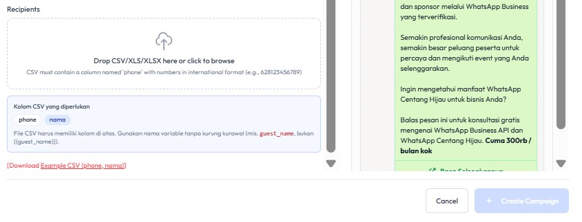

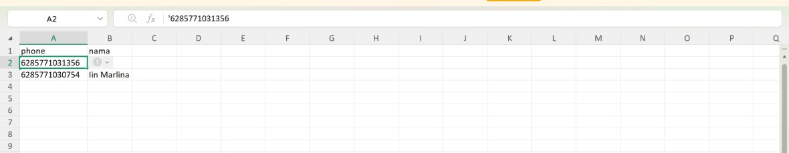

Drop atau pilih file yang sudah diedit sebelumnya pada bagian **Drop CSV/XLS/XLSX here or click to browse**, lalu klik tombol **Create Campaign**.

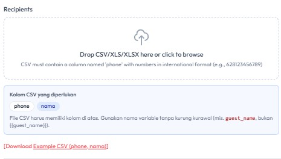

## Pantau hasil broadcast

Broadcast akan otomatis terkirim sesuai tanggal dan waktu yang telah diatur sebelumnya dan berstatus **Scheduled**.

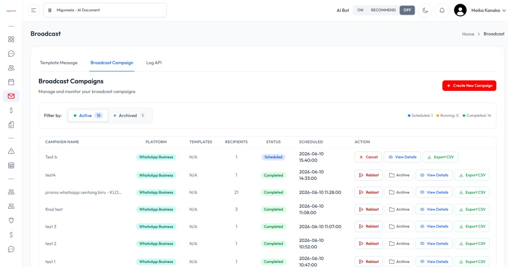

## Video tutorial

Tonton juga panduan video berikut untuk mempelajari langkah broadcast WhatsApp Business secara visual:

<iframe
  width="100%"
  height="400"
  src="https://www.youtube.com/embed/yjvD0dK5LXI"
  title="Tutorial Broadcast WhatsApp Business"
  frameBorder="0"
  allow="accelerometer; autoplay; clipboard-write; encrypted-media; gyroscope; picture-in-picture; web-share"
  allowFullScreen
></iframe>

Atau buka langsung di YouTube: [Tutorial Broadcast WhatsApp Business](https://youtu.be/yjvD0dK5LXI)
