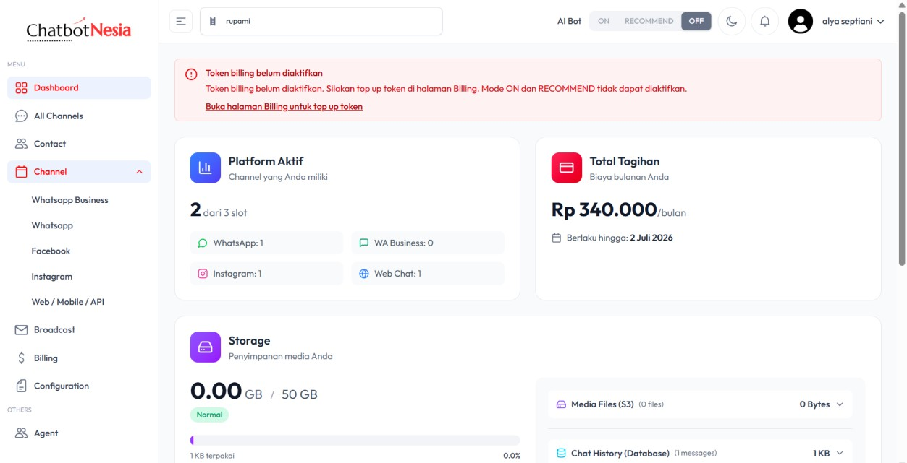
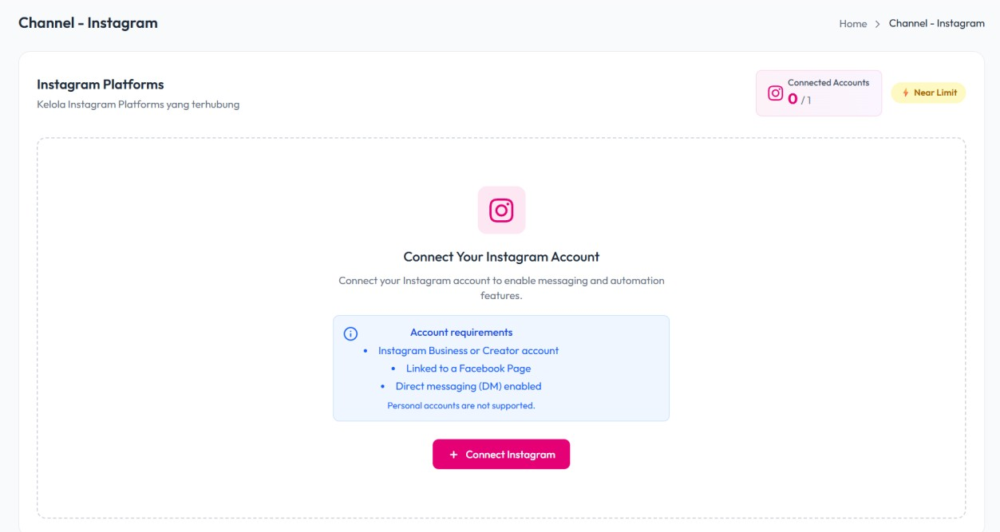
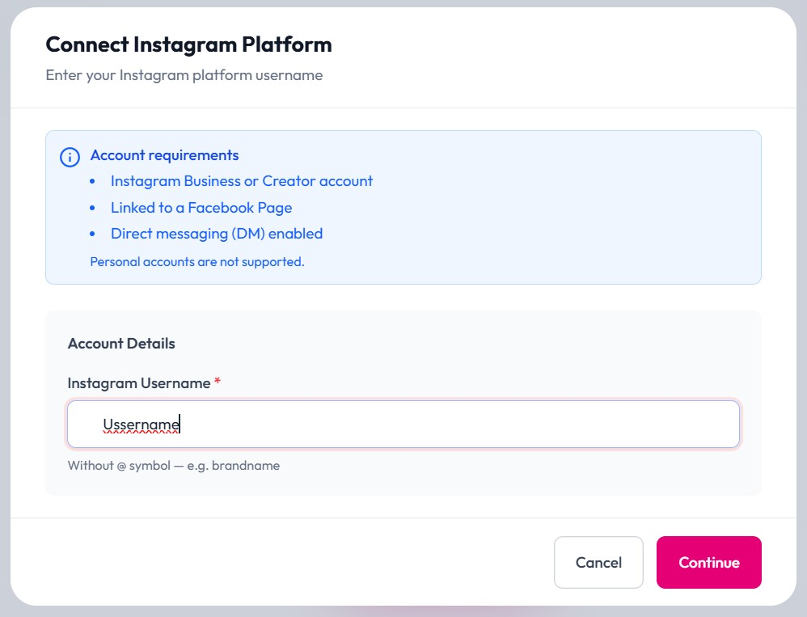
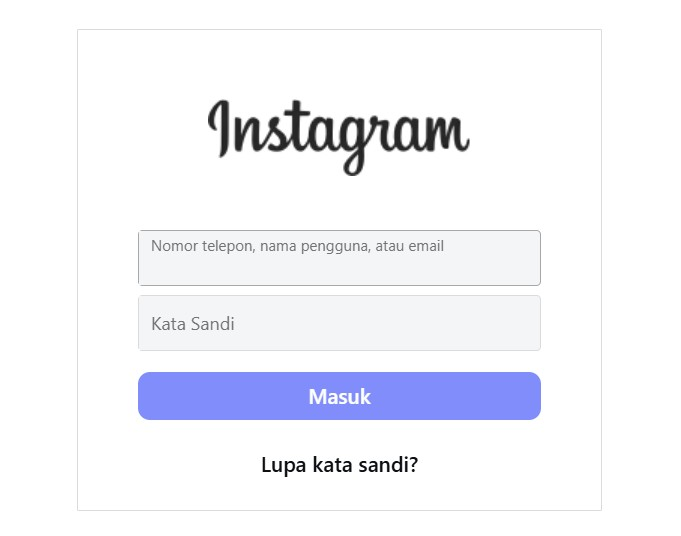
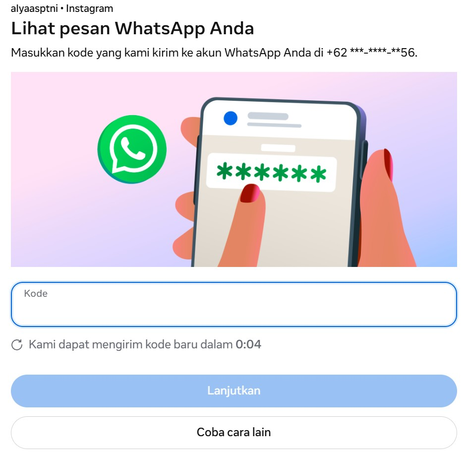
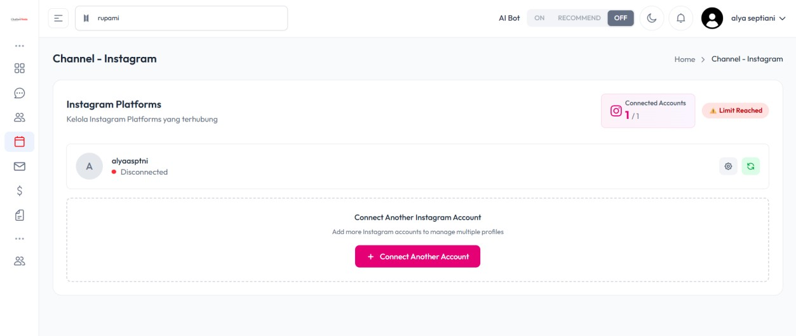
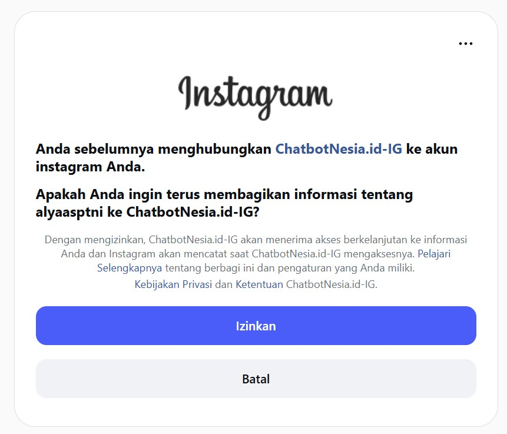
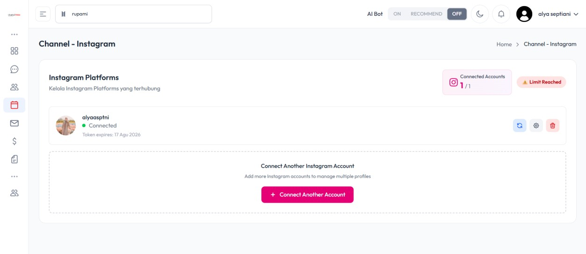
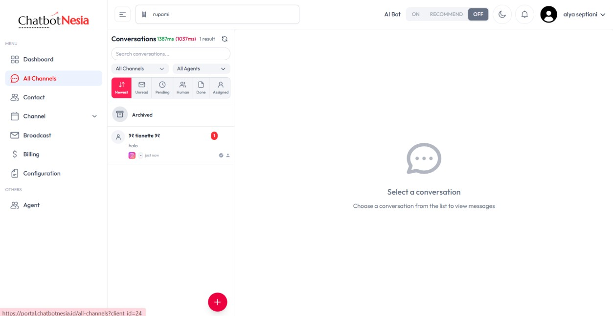

# Cara Connect Instagram Account

Tutorial ini menjelaskan cara menghubungkan akun Instagram ke ChatbotNesia agar pesan masuk dapat dikelola dari satu dashboard.

## Prasyaratan

Sebelum menghubungkan akun, pastikan Instagram Anda memenuhi persyaratan berikut:

- Akun **Instagram Business** atau **Creator**
- Sudah **terhubung ke Facebook Page**
- **Direct messaging (DM)** sudah diaktifkan
- Akun **personal tidak didukung**

## Masuk ke halaman Channel Instagram

Masuk ke halaman **Channel** melalui menu di samping, lalu pilih **Instagram**.

Pada halaman **Channel - Instagram**, klik tombol **+ Connect Instagram**.

## Login ke akun Instagram

Pada jendela **Connect Instagram Platform**, masukkan **Instagram Username** tanpa simbol `@`, lalu klik **Continue**.

Masukkan **nomor telepon, nama pengguna, atau email** beserta **kata sandi** Instagram, lalu klik **Masuk**.

## Verifikasi keamanan

Jika diminta verifikasi, masukkan kode yang terkirim ke **WhatsApp** Anda, lalu klik **Lanjutkan**.

Jika status akun masih **Disconnected**, klik ikon **Refresh** pada baris akun Instagram untuk memperbarui koneksi.

## Izinkan akses dan selesaikan koneksi

Pada halaman otorisasi Instagram, pilih **Izinkan** agar **ChatbotNesia.id-IG** dapat mengakses akun Anda.

Akun Instagram berstatus **Connected**. Anda dapat memantau masa berlaku token serta menggunakan tombol **Refresh**, **Settings**, atau **Delete** jika diperlukan.

## Kelola pesan masuk

Semua pesan yang masuk akan muncul di halaman **All Channel**.

## Video tutorial

Tonton juga panduan video berikut untuk mempelajari cara connect akun Instagram secara visual:

<iframe
  width="100%"
  height="400"
  src="https://www.youtube.com/embed/xE6GZAy61Ps"
  title="Tutorial Connect Akun Instagram di ChatbotNesia"
  frameBorder="0"
  allow="accelerometer; autoplay; clipboard-write; encrypted-media; gyroscope; picture-in-picture; web-share"
  allowFullScreen
></iframe>

Atau buka langsung di YouTube: [Tutorial Connect Akun Instagram di ChatbotNesia](https://youtu.be/xE6GZAy61Ps)
