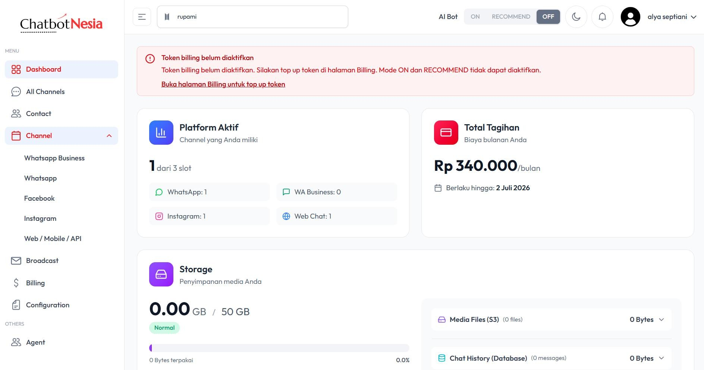
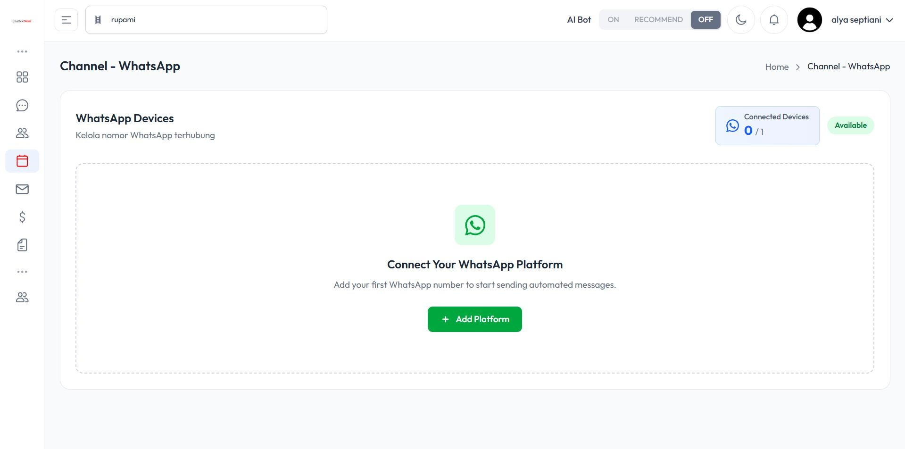
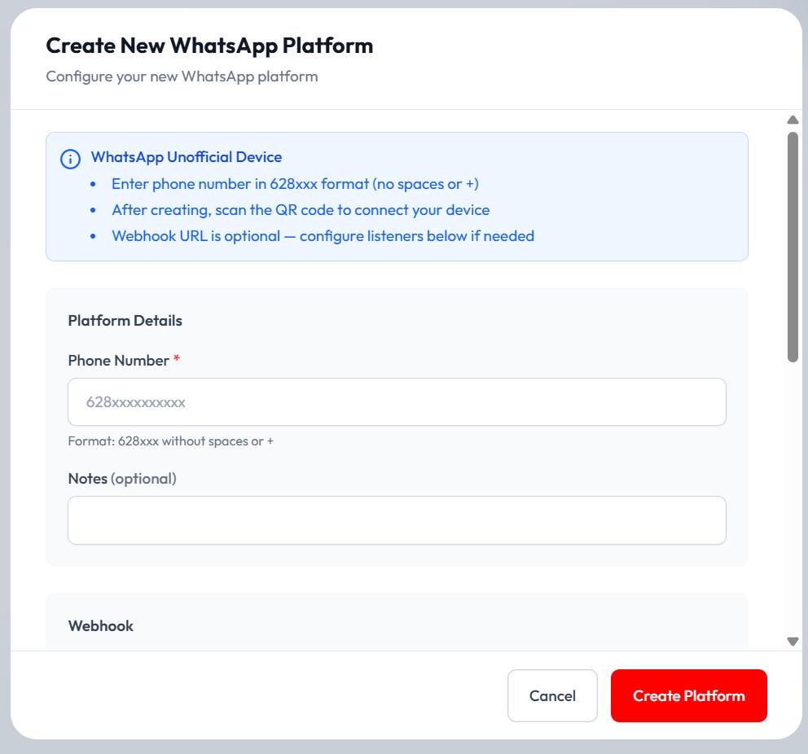
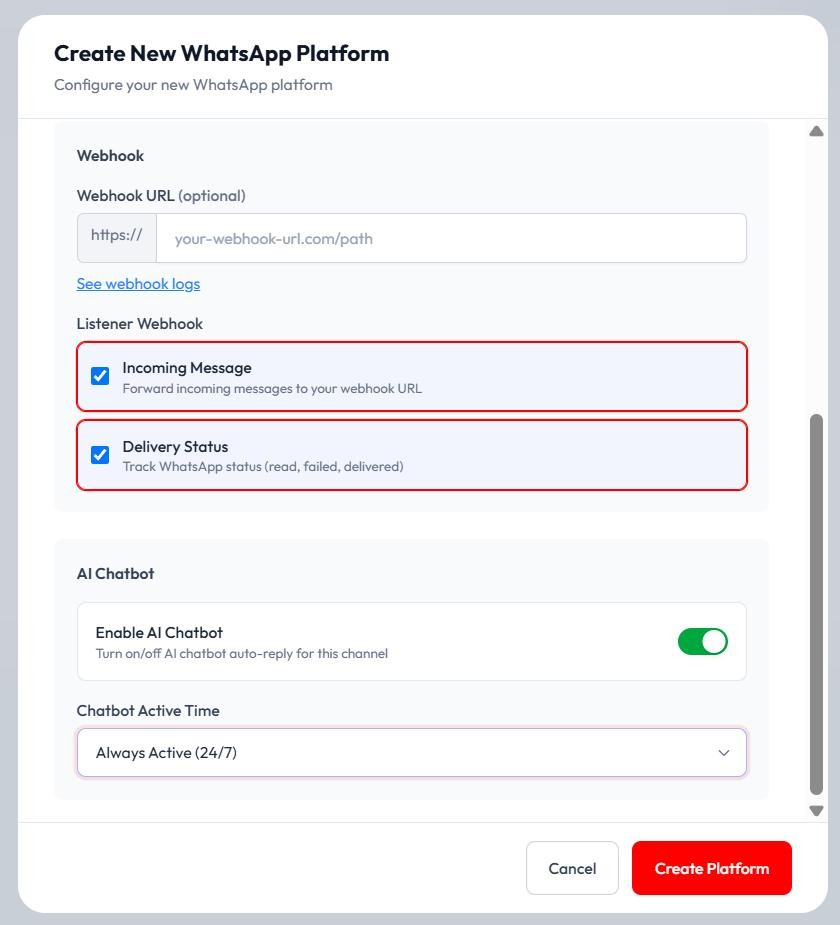
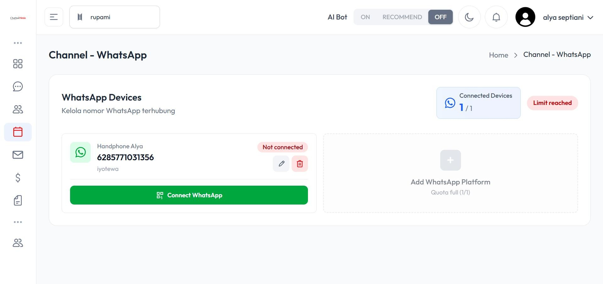
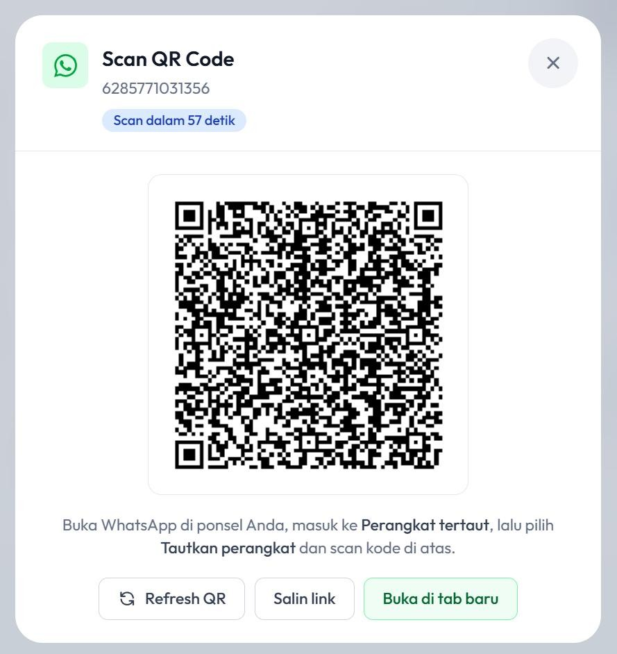
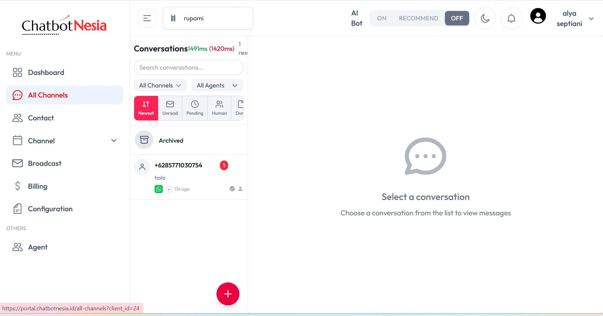

# Cara Connect WhatsApp Account

Tutorial ini menjelaskan cara menghubungkan nomor WhatsApp ke ChatbotNesia agar pesan masuk dapat dikelola dari satu dashboard.

## Masuk ke halaman Channel WhatsApp

Masuk ke halaman **Channel** melalui menu di samping, lalu pilih **WhatsApp**.

Pada halaman **Channel - WhatsApp**, klik tombol **+ Add Platform**.

## Buat platform WhatsApp

Pada jendela **Create New WhatsApp Platform**, isi **Phone Number** dengan format `628xxx` tanpa spasi atau tanda `+`. Kolom **Notes** bersifat opsional.

Centang **Incoming Message** dan **Delivery Status** pada bagian **Listener Webhook**. Pada bagian **Chatbot**, pilih **Always Active (24/7)** atau sesuaikan dengan jam operasional Anda, lalu klik **Create Platform**.

## Hubungkan perangkat WhatsApp

Setelah platform dibuat, klik tombol **Connect WhatsApp** pada kartu device Anda.

Scan **QR Code** menggunakan WhatsApp di handphone Anda. Buka WhatsApp, masuk ke **Perangkat tertaut**, pilih **Tautkan perangkat**, lalu arahkan kamera ke kode QR yang ditampilkan.

## Kelola pesan masuk

Setelah terhubung, semua pesan yang masuk akan muncul di halaman **All Channel**.

## Video tutorial

Tonton juga panduan video berikut untuk mempelajari cara connect akun WhatsApp secara visual:

<iframe
  width="100%"
  height="400"
  src="https://www.youtube.com/embed/WLZOqpqPN9I"
  title="Tutorial Connect Akun WhatsApp di ChatbotNesia"
  frameBorder="0"
  allow="accelerometer; autoplay; clipboard-write; encrypted-media; gyroscope; picture-in-picture; web-share"
  allowFullScreen
></iframe>

Atau buka langsung di YouTube: [Tutorial Connect Akun WhatsApp di ChatbotNesia](https://youtu.be/WLZOqpqPN9I)
