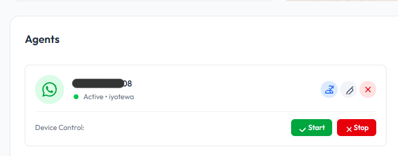
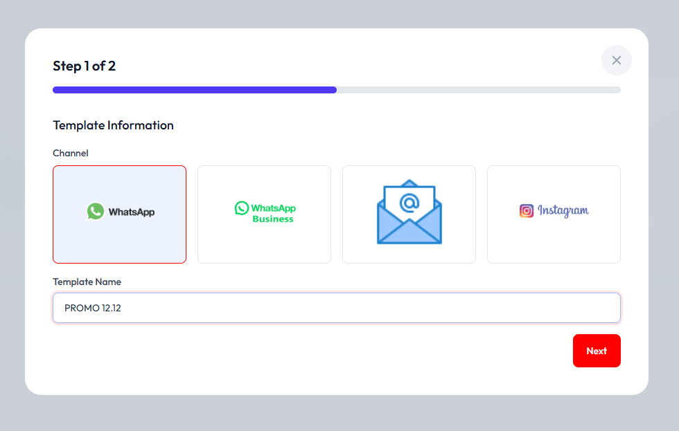
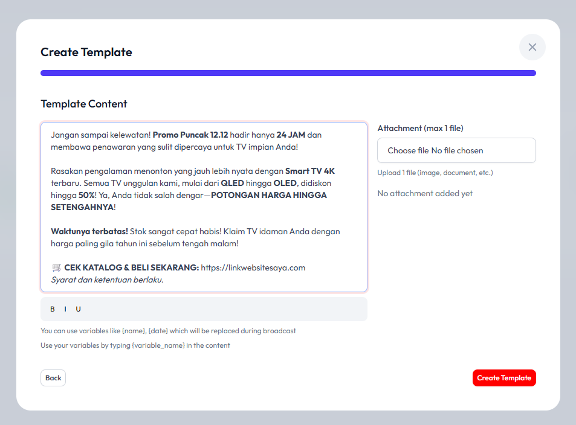
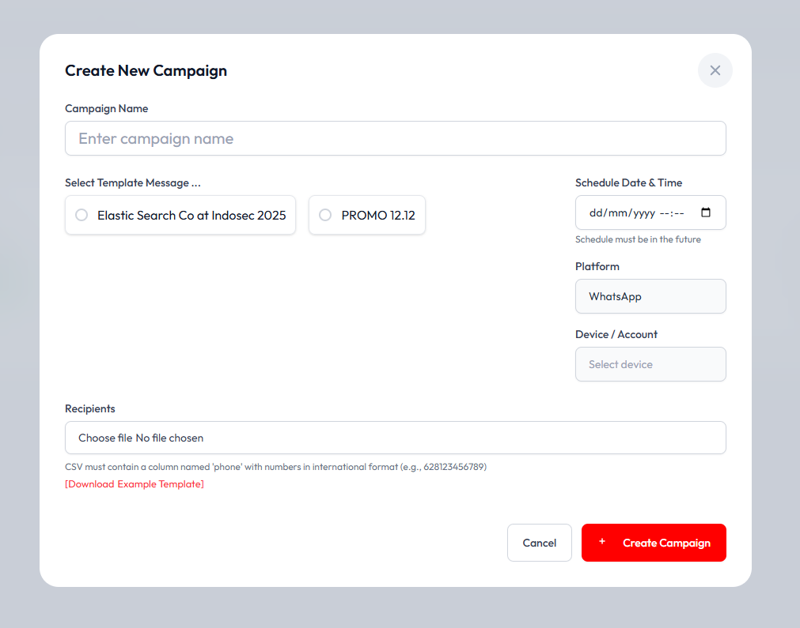
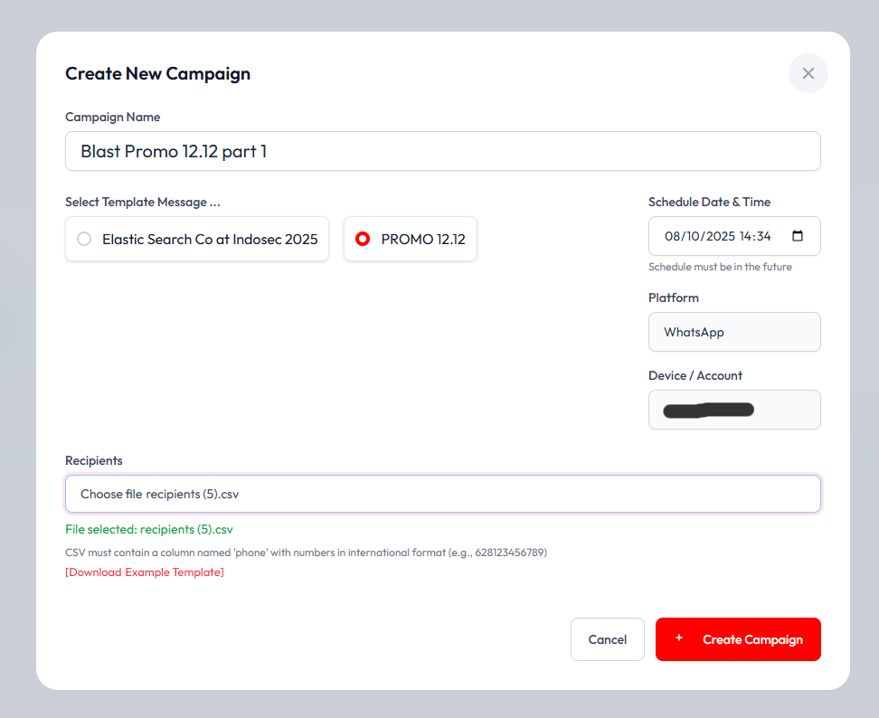
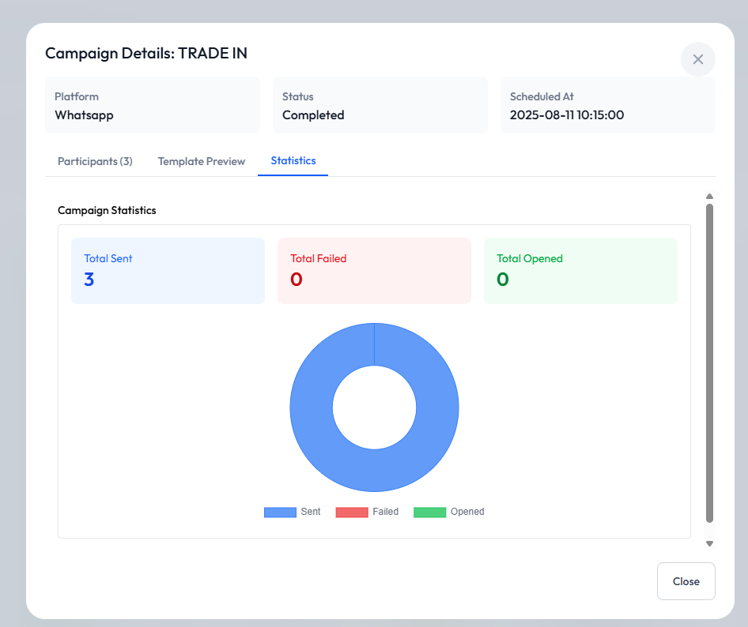

# Cara membuat campaign di whatsapp 

## Pastikan whatsapp sudah connected

Pertama-tama pastikan nomor yang ingin anda jadikan sender broadcast / campaign sudah connect minimal 1 device, anda bisa memeriksa di menu Channel > Whatsapp

Device yang sudah connected akan berstatus "Active"

## Buat template campaign

Masuk ke menu broadcast > Template message, kemudian klik "Create Template"

isi nama template dan pilih jenis platform (Whatsapp, Whatsapp API, Instagram, Email)

Isi narasi / wording text yang akan di blast, kami merokemendasikan untuk memakai banyak variable agar isi konten semakin dinamis

Nama variable bisa diisi dengan kurung kurawal, contoh: `{nama_pelanggan}` atau `{nomor_telepon}` ini harus sesuai dengan nama kolom di file CSV / file Excel

### Mulai broadcast

Masuk ke menu broadcast > Tab Broadcast Campaign

Klik tombol "Create Campaign"

|  |  |
|:---:|:---:|
| 
Isi form campaign 
Campaign name: bisa di isi dengan nama broadcast, misal "Blast Promo 12.12 part 1"
Select template message: pilih template message / narasi yang ingin di blast
Schedule Date & Time: jadwal mulai blasting oleh sistem
Platform: isi whatsapp
Device Account: Nomor sender yang akan di gunakan
Recipients: file csv yang minimal berisi one column "phone" | Setelah di isi konten |

### Pantau hasil

