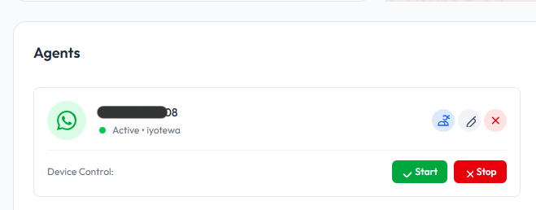

# Integrasi Google Forms dengan Notifikasi WhatsApp

Tutorial ini akan membantu Anda membuat integrasi antara Google Forms dengan notifikasi WhatsApp menggunakan ChatbotNesia API. Ketika seseorang submit Google Form, mereka akan otomatis menerima notifikasi WhatsApp.

## Prasyarat

Sebelum memulai, pastikan Anda sudah:
1. Memiliki akun ChatbotNesia
2. Memiliki akses ke Google Forms dan Google Apps Script

## Langkah 1: Pastikan WhatsApp Sudah Connect dan Ambil API Server Key

### A. Connect WhatsApp Device

Pertama-tama pastikan nomor WhatsApp Anda sudah terhubung:

1. Login ke dashboard ChatbotNesia
2. Masuk ke menu **Channel > WhatsApp**
3. Pastikan device Anda berstatus **"Active"**



:::tip
Jika device belum terhubung, klik tombol "Connect" dan scan QR Code dengan WhatsApp Anda.
:::

### B. Ambil API Server Key

Setelah device terhubung, Anda perlu mendapatkan API Server Key:

1. Di menu **Channel > WhatsApp**, klik tombol **Edit** (icon pensil) pada device yang sudah aktif
2. Scroll ke bawah untuk menemukan **API Server Key**


3. Copy API Server Key tersebut (Anda akan menggunakannya di Google Apps Script nanti)
4. Simpan API Server Key di tempat yang aman

:::warning Penting
Jangan share API Server Key Anda ke orang lain. API Key ini digunakan untuk autentikasi dan mengirim pesan dari sistem Anda.
:::

## Langkah 2: Buat Google Form dan Link dengan Google Sheets

### A. Buat Google Form

Sekarang buat Google Form dengan field yang Anda butuhkan. Untuk contoh ini, kita akan membuat form pendaftaran sederhana:

1. Buka [Google Forms](https://forms.google.com)
2. Buat form baru dengan field:
   - **Nama Lengkap** (Short answer)
   - **Nomor WhatsApp** (Short answer)
   - **Email** (Short answer)
   - **Pesan/Keperluan** (Paragraph)

:::tip
Pastikan field nomor WhatsApp diberi instruksi untuk mengisi dengan format internasional, contoh: 628123456789 (tanpa tanda + atau -)
:::

### B. Link Form dengan Google Sheets (SANGAT PENTING!)

⚠️ **WAJIB DILAKUKAN!** Tanpa langkah ini, script tidak akan bisa membaca data form.

1. Di Google Form Anda, klik tab **Responses** (Tanggapan) di bagian atas
2. Klik icon **Google Sheets** (icon hijau dengan tanda +) di pojok kanan atas bagian Responses
3. Dialog akan muncul, pilih:
   - **Create a new spreadsheet** (Buat spreadsheet baru)
   - Atau **Select existing spreadsheet** (jika sudah ada)
4. Klik **Create**
5. Google Sheets akan terbuka otomatis (Anda bisa tutup tab ini)
6. Kembali ke Google Form Anda

:::danger PENTING
Jika form tidak di-link dengan Google Sheets, event object akan kosong dan script akan error dengan pesan "e.namedValues tidak ada". **WAJIB link dengan Sheets terlebih dahulu!**
:::

## Langkah 3: Buka Google Apps Script

1. Di Google Spreadsheet Anda, klik menu extensions di menubar
2. Pilih **Apps Script**
3. Anda akan diarahkan ke Google Apps Script editor


## Langkah 4: Tambahkan Script untuk Kirim Notifikasi WhatsApp

Hapus kode default dan ganti dengan kode berikut. **Jangan lupa ganti `YOUR_API_KEY_HERE` dengan API Server Key yang Anda dapatkan dari Langkah 1.**

### A. Kirim Pesan Text Sederhana

```javascript
// Ganti dengan API Key Anda dari ChatbotNesia
const API_KEY = 'YOUR_API_KEY_HERE';
const API_BASE_URL = 'https://api.chatbotnesia.id';

function onFormSubmit(e) {
  try {
    // Validasi event object
    if (!e) {
      Logger.log('Error: Event object tidak valid. Pastikan trigger sudah diatur dengan benar.');
      return;
    }
    
    // Ambil response dari form
    // Pastikan form sudah di-link dengan Google Sheets!
    const responses = e.namedValues;
    
    if (!responses) {
      Logger.log('Error: Form belum di-link dengan Google Sheets!');
      Logger.log('Buka Google Form > Tab Responses > Klik icon Google Sheets.');
      return;
    }
    
    // Ambil data dari form (sesuaikan dengan nama field di form Anda)
    const namaLengkap = responses['Nama Lengkap'][0];
    const nomorWhatsApp = responses['Nomor WhatsApp'][0];
    const email = responses['Email'][0];
    const pesan = responses['Pesan/Keperluan'][0];
    
    // Format nomor WhatsApp (pastikan format: 628xxx)
    let phoneNumber = nomorWhatsApp.replace(/\D/g, ''); // Hapus karakter non-digit
    
    // Jika dimulai dengan 0, ganti dengan 62
    if (phoneNumber.startsWith('0')) {
      phoneNumber = '62' + phoneNumber.substring(1);
    }
    
    // Jika tidak dimulai dengan 62, tambahkan 62
    if (!phoneNumber.startsWith('62')) {
      phoneNumber = '62' + phoneNumber;
    }
    
    // Buat pesan yang akan dikirim
    const message = `Halo *${namaLengkap}*! 👋

Terima kasih telah mengisi form kami. 

Berikut adalah data yang Anda kirimkan:
━━━━━━━━━━━━━━━━━━━
📝 *Nama:* ${namaLengkap}
📱 *WhatsApp:* ${nomorWhatsApp}
📧 *Email:* ${email}
💬 *Pesan:* ${pesan}
━━━━━━━━━━━━━━━━━━━

Kami akan segera menghubungi Anda. 

Terima kasih! 🙏`;
    
    // Kirim pesan WhatsApp
    const result = sendWhatsAppMessage(phoneNumber, message);
    
    // Log hasil
    Logger.log('WhatsApp sent successfully: ' + JSON.stringify(result));
    
  } catch (error) {
    Logger.log('Error: ' + error.toString());
  }
}

function sendWhatsAppMessage(phoneNumber, message, scheduledAt = null) {
  const url = `${API_BASE_URL}/broadcast/whatsapp/send-message`;
  
  const payload = {
    phone_number: phoneNumber,
    message: message
  };
  
  // Tambahkan scheduled_at jika ada
  if (scheduledAt) {
    payload.scheduled_at = scheduledAt;
  }
  
  const options = {
    method: 'post',
    contentType: 'application/json',
    headers: {
      'Authorization': 'Bearer ' + API_KEY
    },
    payload: JSON.stringify(payload),
    muteHttpExceptions: true
  };
  
  try {
    const response = UrlFetchApp.fetch(url, options);
    const responseCode = response.getResponseCode();
    const responseBody = JSON.parse(response.getContentText());
    
    if (responseCode === 200) {
      Logger.log('Message sent successfully. Message ID: ' + responseBody.message_id);
      return responseBody;
    } else {
      Logger.log('Failed to send message. Status: ' + responseCode);
      Logger.log('Response: ' + JSON.stringify(responseBody));
      throw new Error('Failed to send WhatsApp message');
    }
  } catch (error) {
    Logger.log('Error sending WhatsApp: ' + error.toString());
    throw error;
  }
}
```

### B. Kirim Pesan dengan Attachment (Gambar/File)

Jika Anda ingin mengirim pesan dengan attachment seperti gambar, PDF, atau file lainnya:

```javascript
// Ganti dengan API Key Anda dari ChatbotNesia
const API_KEY = 'YOUR_API_KEY_HERE';
const API_BASE_URL = 'https://api.chatbotnesia.id';

function onFormSubmit(e) {
  try {
    // Validasi event object
    if (!e) {
      Logger.log('Error: Event object tidak valid. Pastikan trigger sudah diatur dengan benar.');
      return;
    }
    
    // Ambil response dari form
    // Pastikan form sudah di-link dengan Google Sheets!
    const responses = e.namedValues;
    
    if (!responses) {
      Logger.log('Error: Form belum di-link dengan Google Sheets!');
      Logger.log('Buka Google Form > Tab Responses > Klik icon Google Sheets.');
      return;
    }
    
    // Ambil data dari form
    const namaLengkap = responses['Nama Lengkap'][0];
    const nomorWhatsApp = responses['Nomor WhatsApp'][0];
    const email = responses['Email'][0];
    
    // Format nomor WhatsApp
    let phoneNumber = formatPhoneNumber(nomorWhatsApp);
    
    // Buat pesan
    const message = `Halo *${namaLengkap}*! 👋

Terima kasih telah mendaftar. Berikut adalah panduan lengkap kami (terlampir).

Salam,
Tim ChatbotNesia`;
    
    // URL gambar atau file yang akan dikirim (harus publicly accessible)
    const attachmentUrl = 'https://yourdomain.com/path/to/your/file.pdf';
    
    // Kirim pesan dengan attachment
    const result = sendWhatsAppAttachment(phoneNumber, message, attachmentUrl);
    
    Logger.log('WhatsApp sent successfully: ' + JSON.stringify(result));
    
  } catch (error) {
    Logger.log('Error: ' + error.toString());
  }
}

function formatPhoneNumber(phoneNumber) {
  // Hapus karakter non-digit
  let formatted = phoneNumber.replace(/\D/g, '');
  
  // Jika dimulai dengan 0, ganti dengan 62
  if (formatted.startsWith('0')) {
    formatted = '62' + formatted.substring(1);
  }
  
  // Jika tidak dimulai dengan 62, tambahkan 62
  if (!formatted.startsWith('62')) {
    formatted = '62' + formatted;
  }
  
  return formatted;
}

function sendWhatsAppAttachment(phoneNumber, message, attachmentUrl, scheduledAt = null) {
  const url = `${API_BASE_URL}/broadcast/whatsapp/send-attachment`;
  
  const payload = {
    phone_number: phoneNumber,
    message: message,
    attachment: attachmentUrl // Bisa berupa URL public atau base64
  };
  
  // Tambahkan scheduled_at jika ada
  if (scheduledAt) {
    payload.scheduled_at = scheduledAt;
  }
  
  const options = {
    method: 'post',
    contentType: 'application/json',
    headers: {
      'Authorization': 'Bearer ' + API_KEY
    },
    payload: JSON.stringify(payload),
    muteHttpExceptions: true
  };
  
  try {
    const response = UrlFetchApp.fetch(url, options);
    const responseCode = response.getResponseCode();
    const responseBody = JSON.parse(response.getContentText());
    
    if (responseCode === 200) {
      Logger.log('Message with attachment sent successfully. Message ID: ' + responseBody.message_id);
      return responseBody;
    } else {
      Logger.log('Failed to send message. Status: ' + responseCode);
      Logger.log('Response: ' + JSON.stringify(responseBody));
      throw new Error('Failed to send WhatsApp message with attachment');
    }
  } catch (error) {
    Logger.log('Error sending WhatsApp: ' + error.toString());
    throw error;
  }
}
```

## Langkah 5: Setup Trigger (SANGAT PENTING!)

⚠️ **INI LANGKAH PALING KRUSIAL!** Tanpa trigger yang benar, script tidak akan jalan.

### A. Hapus Trigger Lama (Jika Ada)

Jika Anda sudah pernah membuat trigger sebelumnya:

1. Di Apps Script editor, klik icon **Triggers** (⏰) di sidebar kiri
2. Jika ada trigger lama, klik **titik tiga (⋮)** → **Delete trigger**
3. Konfirmasi penghapusan

### B. Buat Trigger Baru yang Benar

Sekarang buat trigger baru dengan konfigurasi yang TEPAT:

1. Di Apps Script editor, klik icon **Triggers** (⏰) di sidebar kiri
2. Klik tombol **+ Add Trigger** di pojok kanan bawah
3. **PASTIKAN** konfigurasi trigger seperti ini:
   


4. Klik **Save**
5. Anda akan diminta **Review permissions**:
   - Klik **Review permissions**
   - Pilih akun Google Anda
   - Klik **Advanced** (jika muncul warning)
   - Klik **Go to [Nama Project] (unsafe)**
   - Klik **Allow**

## Langkah 6: Testing

⚠️ **CARA TESTING YANG BENAR:**

### ❌ JANGAN Lakukan Ini:
- ❌ Klik tombol **"Run"** di Apps Script editor
- ❌ Pilih fungsi dan klik "Execute"
- ❌ Testing di Apps Script editor

**Mengapa?** Karena parameter `e` (event object) hanya ada saat form di-submit, bukan saat run manual!

### ✅ LAKUKAN Ini:

1. **Buka Google Form Anda** (bukan Apps Script!)
   - Salin link preview form atau buka form dari dashboard
   
2. **Isi form dengan data test**
   - Gunakan nomor WhatsApp Anda sendiri untuk testing
   - Format nomor: 08123456789 atau 628123456789
   
3. **Klik Submit**
   - Submit form seperti user biasa
   
4. **Tunggu 3-5 detik**
   - Cek WhatsApp Anda
   - Seharusnya menerima pesan otomatis

5. **Cek Execution Log**
   - Buka Apps Script editor
   - Klik icon **Executions** (⚙️) di sidebar kiri
   - Lihat execution terakhir:
     - ✅ Status: **Completed** = Berhasil
     - ❌ Status: **Failed** = Ada error, klik untuk lihat detail

:::tip Cara Melihat Log Detail
1. Di halaman **Executions**, klik execution yang ingin dilihat
2. Akan muncul detail log dengan semua `Logger.log()` yang Anda tulis
3. Gunakan ini untuk debugging jika ada masalah
:::

## Langkah 7: Monitoring Log API di Portal ChatbotNesia

Setelah mengirim pesan, Anda dapat memantau status pengiriman pesan melalui portal ChatbotNesia:

### Cara Melihat Log API

1. Login ke dashboard ChatbotNesia
2. Masuk ke menu **Broadcast**
3. Pilih tab **Log API**
4. Anda akan melihat daftar semua pesan yang dikirim melalui API


### Informasi yang Tersedia di Log API

Dari halaman Log API, Anda dapat melihat:

- **DEVICE**: Nomor WhatsApp pengirim yang digunakan
- **RECEIPT**: Nomor WhatsApp penerima
- **MESSAGE**: Isi pesan yang dikirim
- **ATTACHMENT**: File attachment (jika ada)
- **STATUS**: Status pengiriman pesan
  - 🟢 **Delivered**: Pesan berhasil terkirim
  - 🔴 **Failed**: Pesan gagal terkirim
  - 🟡 **Pending**: Pesan sedang dalam antrian
- **CREATED AT**: Waktu pesan dibuat/dikirim

### Filter dan Pencarian

Anda dapat memfilter log berdasarkan:
- **Device**: Pilih device WhatsApp tertentu
- **Status**: Filter berdasarkan status (All Status, Delivered, Failed, Pending)
- **Tanggal**: Filter berdasarkan rentang tanggal (From - To)

:::tip Monitoring
Cek log API secara berkala untuk memastikan semua pesan terkirim dengan baik. Jika ada pesan dengan status "Failed", periksa:
- Apakah nomor WhatsApp penerima valid?
- Apakah nomor tersebut terdaftar di WhatsApp?
- Apakah device pengirim masih aktif?
:::

## API Reference

### Send Message (Text)

📖 **Dokumentasi lengkap:** [Send Message API](https://iyote-indonesia.github.io/chatbotnesia-doc/docs/chatbotnesia/send-message-broadcast-whatsapp-send-message-post)

### Send Message Attachment

📖 **Dokumentasi lengkap:** [Send Attachment API](https://iyote-indonesia.github.io/chatbotnesia-doc/docs/chatbotnesia/send-message-attachment-broadcast-whatsapp-send-attachment-post)

## Kesimpulan

Dengan mengintegrasikan Google Forms dan ChatbotNesia API, Anda dapat:
- ✅ Otomatis mengirim konfirmasi ke responden
- ✅ Meningkatkan engagement dengan customer
- ✅ Memberikan pengalaman yang lebih baik
- ✅ Menghemat waktu tim Anda

Jika ada pertanyaan atau butuh bantuan, silakan hubungi tim support ChatbotNesia.

---

**Sumber Referensi:**
- [ChatbotNesia API Documentation](https://iyote-indonesia.github.io/chatbotnesia-doc/)
- [Google Apps Script Documentation](https://developers.google.com/apps-script)

